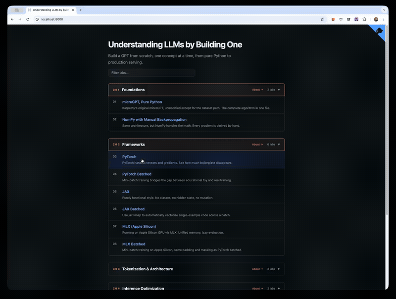

# walk-the-code

AI coding agents help us write code — but can they also help us explain it? Walk-the-code turns any codebase into an interactive **code walkthrough** where readers click a line, read what it does, and see the architecture light up. Use an AI agent to generate the walkthrough, deploy it to GitHub Pages, and keep it in sync as the code evolves.

Supports 30+ languages, Mermaid diagrams with per-line highlighting, nested groups, guided tours, exercises, and embeddable widgets.

**[Live demo →](https://danilop.github.io/micro-gpt-and-beyond/)** — 24 units walking through a GPT implementation from pure Python to production serving.



## Generate a walkthrough with an AI coding agent

The fastest way to create a walkthrough for any repo. Ask your AI coding agent:

> Read the walk-the-code skill at https://github.com/danilop/walk-the-code/blob/main/walk-the-code-skill/SKILL.md and create a code walkthrough for this repository.

Or, if your agent doesn't support [Agent Skills](https://agentskills.io/), paste the contents of [`PROMPT.md`](PROMPT.md) into your chat instead — it links to the same workflow.

The agent analyzes your codebase and generates everything: `config.json`, line-by-line annotations, Mermaid diagrams, learning objectives, and exercises. No scaffolding needed — it creates a real config tailored to your code.

Then preview locally:

```bash
uv tool install "walk-the-code @ git+https://github.com/danilop/walk-the-code"
wtc-serve --config walk-the-code/config.json
# Open http://localhost:8000
```

**Keep it updated** after code changes:

> Run `wtc-validate --strict walk-the-code/config.json` and fix all stale annotations.

**Deploy to GitHub Pages** — ask your agent:

> Add a GitHub Actions workflow that builds and deploys the walkthrough to GitHub Pages.

See [full AI workflow details](#ai-assisted-workflow) below, including CI/CD validation and deployment YAML.

Two files support AI agents — choose based on your agent's capabilities:

| File | Format | When to use |
|---|---|---|
| [`walk-the-code-skill/SKILL.md`](walk-the-code-skill/SKILL.md) | [Agent Skill](https://agentskills.io/) (YAML frontmatter + instructions) | Your agent supports skills — install it once, the agent activates it automatically when relevant |
| [`PROMPT.md`](PROMPT.md) | Plain prompt linking to the skill and README | Your agent doesn't support skills, or you want a one-off walkthrough without installing anything |

## Quick start

Try the included example (Monte Carlo Pi in Python and Java):

```bash
git clone https://github.com/danilop/walk-the-code.git
cd walk-the-code
python3 server.py --config example/config.json
# Open http://localhost:8000
```

Requires [uv](https://docs.astral.sh/uv/) (Python package manager). Install with `curl -LsSf https://astral.sh/uv/install.sh | sh`.

## Install as a CLI tool

```bash
uv tool install "walk-the-code @ git+https://github.com/danilop/walk-the-code"
```

Six commands available from anywhere:

```bash
wtc-serve --config path/to/config.json        # start the tutorial server
wtc-build path/to/config.json                  # build static site for GitHub Pages
wtc-init                                       # scaffold a new tutorial project (manual authoring)
wtc-validate path/to/config.json               # validate config and content
wtc-hash path/to/config.json                   # add/update content hashes in comment files
walk-the-code --config path/to/config.json     # alias for wtc-serve
```

## How it works

- **config.json** — project metadata, group structure, unit definitions, optional run commands, and [custom terminology](#terminology)
- **comments/** — line-by-line explanations in a mirror structure, matched to code via content hashes
- **diagrams/** — shared Mermaid diagrams referenced from comments, with per-line node and flow highlighting
- **wtc-serve** — local server with code browsing, group navigation, and optional code execution via SSE
- **wtc-build** — bundles everything into `data/units.json` for static deployment (GitHub Pages)

## Features

### Guided tour mode

Click "Start Guided Tour" in the unit overview, or add `?tour=true` to the URL. Steps through all annotated lines with a persistent control bar.

### Multi-file units

Units can display multiple source files with a tab bar. Use `files` instead of `file`:

```json
{
  "id": "my_app",
  "files": [{"path": "main.py", "role": "primary"}, {"path": "utils.py"}],
  "title": "My App"
}
```

Comments go in `comments/my_app/main.json` and `comments/my_app/utils.json`.

### Nested groups

Groups can contain sub-groups for hierarchical grouping:

```json
{
  "groups": [{
    "id": "part1", "title": "Part 1",
      "groups": [
      {"id": "ch1", "title": "Group 1", "units": ["unit1", "unit2"]},
      {"id": "ch2", "title": "Group 2", "units": ["unit3"]}
    ]
  }]
}
```

### Embedding

Embed a single unit in any page:

```html
<iframe src="https://your-site.github.io/embed.html?unit=my_unit"
  width="100%" height="500"
  sandbox="allow-scripts allow-same-origin"
  loading="lazy"></iframe>
```

URL params: `unit` (required), `file`, `line`, `tour=true`. Supports postMessage API: send `{type:'wtc:selectLine', line:N}`, receive `{type:'wtc:lineSelected', line:N, unit:'id'}`.

### Running code

Add `run_command` to any unit. The Run button appears in the browser when using the local server:

```json
{"id": "my_unit", "file": "pi.py", "run_command": ["python3", "pi.py"]}
```

Use `sh -c "..."` for compile-then-run languages. Code execution only works with the local server — static deployments are read-only.

### Custom analytics

Set `analytics_file` in config.json to inject a custom HTML snippet into all pages:

```json
{"analytics_file": "analytics.html"}
```

Example for [Umami](https://umami.is/):
```html
<script defer src="https://cloud.umami.is/script.js" data-website-id="YOUR-ID"></script>
```

Example for [GoatCounter](https://www.goatcounter.com/):
```html
<script data-goatcounter="https://YOURSITE.goatcounter.com/count" async src="//gc.zgo.at/count.js"></script>
```

### Keyboard shortcuts

| Key | Action |
|---|---|
| `↓` or `j` | Next annotated line |
| `↑` or `k` | Previous annotated line |
| `→` or `j` (in tour) | Next tour step |
| `←` or `k` (in tour) | Previous tour step |
| `Escape` | Return to overview / exit tour |
| Click any line | Jump to that line's explanation |

### Supported languages

Python, JavaScript, TypeScript, C, C++, Rust, Go, Java, Ruby, PHP, Swift, Kotlin, Scala, C#, Lua, R, Bash, YAML, JSON, XML, HTML, CSS, SCSS, SQL, Markdown, Dockerfile, HCL/Terraform, Protocol Buffers, Zig, Dart, Elixir, Haskell, OCaml, Clojure.

Language is auto-detected from the file extension. Override per-unit with `"language": "rust"`.

---

## Authoring guide

This section covers manual walkthrough creation and the full config reference. If you're using an AI agent, it handles all of this — refer here only for details.

### Config reference

#### Top-level fields

| Field | Required | Description |
|---|---|---|
| `title` | no | Project title shown on the index page |
| `tagline` | no | Subtitle shown below the title |
| `repo_url` | no | Repository URL for the GitHub corner link |
| `language` | no | Default language for all units (auto-detected from file extension if omitted) |
| `code_dir` | no | Path to the code directory, relative to config.json (defaults to `.`) |
| `terminology` | no | Custom display names for hierarchy levels (see [Terminology](#terminology)) |
| `analytics_file` | no | Path to an HTML file injected before `</body>` on all pages |
| `groups` | no | Array of group objects that organize units |
| `units` | yes | Array of unit objects |

#### Group fields

| Field | Required | Description |
|---|---|---|
| `id` | yes | Unique group identifier |
| `title` | yes | Group title |
| `description` | no | HTML description shown on the group page |
| `diagram` | no | Inline Mermaid source rendered on the group page |
| `comparison_diagram` | no | References a `.mmd` file in `diagrams/` |
| `units` | no | Ordered list of unit IDs belonging to this group |
| `groups` | no | Array of sub-group objects for hierarchical grouping |
| `knowledge_checks` | no | Array of multiple-choice quiz objects |

#### Unit fields

| Field | Required | Description |
|---|---|---|
| `id` | yes | Unique unit identifier — used as a subdirectory under `code_dir` (code is at `code_dir/<id>/<file>`) |
| `file` | yes | Source file to display |
| `files` | no | Array of `{path, role}` objects for multi-file units (overrides `file`) |
| `title` | yes | Unit title |
| `tagline` | no | One-line summary shown on index and group pages |
| `description` | no | HTML overview shown before any line is selected |
| `language` | no | Override the default language for this unit |
| `run_command` | no | Command to execute the unit (enables Run button in server mode) |
| `learning_objectives` | no | Array of strings describing learning outcomes |
| `exercises` | no | Array of `{prompt, hint}` objects shown with completion checkboxes |

#### Terminology

Customize the display names for the two hierarchy levels. The JSON keys (`groups`, `units`) never change — only the UI labels do.

```json
{
  "terminology": {
    "group": "Module", "group_plural": "Modules",
    "unit": "Lesson", "unit_plural": "Lessons"
  }
}
```

Defaults: `Group`/`Groups` and `Unit`/`Units`. Plurals are auto-derived by appending `s` unless explicitly set.

### Comment format

Comments live in `comments/<unit_id>/<filename_without_ext>.json`:

```json
{
  "42": {
    "text": "Scaled dot-product attention: Q·K^T / sqrt(d)",
    "hash": "a1b2c3d4",
    "important": true,
    "diagram": "attention_flow",
    "highlight": { "nodes": ["Q_node", "K_node"], "links": [0, 1] }
  }
}
```

| Field | Required | Description |
|---|---|---|
| `text` | yes | HTML explanation shown in the side panel |
| `hash` | yes | SHA-256 prefix of the code line (auto-generated by `wtc-hash`) |
| `important` | no | Marks this line as a key concept (orange gutter dot) |
| `diagram` | no | References a `.mmd` file in `diagrams/` by name (without extension) |
| `highlight` | no | Node IDs to highlight, or `{nodes, links}` for flow highlighting |

#### Gutter indicators

- **Hollow dot** — line has an explanation
- **Orange dot** — key concept (`"important": true`)
- **Blue dot** — has a diagram reference

Dots brighten on hover. A persistent legend is shown below the progress bar.

#### Stale annotation detection

Each comment stores a SHA-256 hash of the code line. When code changes but the comment isn't updated, the viewer shows a warning. Run `wtc-hash` after editing comments:

```bash
wtc-hash path/to/config.json
```

### Diagrams

Place `.mmd` files in `diagrams/`. Reference them from comments by filename (without `.mmd`). A single diagram can be shared across multiple files with different `highlight` values — the reader sees the same architecture with different nodes lit up as they navigate.

Groups can also have inline Mermaid diagrams via the `diagram` field (raw Mermaid source, not a file reference).

### Exercises and knowledge checks

Units can have exercises (hands-on prompts with optional hints):

```json
{
  "exercises": [
    {
      "prompt": "Change the learning rate from 0.01 to 0.1 and observe how training loss changes.",
      "hint": "Look at the optimizer initialization around line 45."
    }
  ]
}
```

Exercises render in the unit overview with completion checkboxes (persisted in localStorage).

Groups can have knowledge checks (multiple-choice quizzes):

```json
{
  "knowledge_checks": [
    {
      "question": "What does the Value class track?",
      "options": ["Data types", "A computation graph", "Memory allocation", "Learning rate"],
      "correct": 1,
      "explanation": "The Value class records operations in a computation graph for automatic differentiation."
    }
  ]
}
```

### Validation

```bash
wtc-validate path/to/config.json
```

Checks: required fields, file existence, JSON validity, diagram references, line ranges, hash freshness, group references, coverage.

### How-to guides

#### Create your first unit

1. Write your code file (e.g. `samples/hello.py`)
2. Create `comments/hello/hello.json`:
   ```json
   {
     "1": { "text": "Import the math module for arithmetic helpers." },
     "5": { "text": "This is where the main logic starts.", "important": true }
   }
   ```
3. Add the unit to `config.json`:
   ```json
   { "id": "hello", "file": "hello.py", "title": "Hello World" }
   ```
4. Run `wtc-hash config.json` then `wtc-serve --config config.json`

#### Add diagrams to a unit

1. Create `diagrams/data_flow.mmd`:
   ```
   graph LR
     A[Read input] --> B[Process]
     B --> C[Write output]
   ```
2. Reference from comments with different highlights per line:
   ```json
   {
     "3": { "text": "Read data from stdin.", "diagram": "data_flow", "highlight": ["A"] },
     "7": { "text": "Transform the data.", "diagram": "data_flow", "highlight": { "nodes": ["B"], "links": [1] } }
   }
   ```

#### Scaffold a new project manually

Run `wtc-init` to create `config.json`, `samples/`, `comments/`, and `diagrams/` with a starter template. Then replace the sample content with your own files.

---

## AI-assisted workflow

Full details for the [AI generation flow](#generate-a-walkthrough-with-an-ai-coding-agent) described at the top.

### Update after code changes

Ask your agent:

> Run `wtc-validate --strict walk-the-code/config.json` and fix all stale annotations. Update the explanations to match the current code.

The validator reports which annotations are out of sync. The agent updates only the affected comment files and re-runs `wtc-hash`.

### CI/CD validation

Add a GitHub Actions workflow to catch stale annotations on every push:

```yaml
name: Walkthrough validation
on: [push, pull_request]
jobs:
  validate:
    runs-on: ubuntu-latest
    steps:
      - uses: actions/checkout@v4
      - uses: actions/setup-python@v5
        with:
          python-version: "3.12"
      - run: pip install "walk-the-code @ git+https://github.com/danilop/walk-the-code"
      - run: wtc-validate --strict walk-the-code/config.json
```

Without `--strict`, stale hashes are warnings (exit code 0). With `--strict`, they become errors (exit code 1), blocking the build.

### Deploy to GitHub Pages

```yaml
name: Deploy walkthrough
on:
  push:
    branches: [main]
permissions:
  contents: read
  pages: write
  id-token: write
jobs:
  deploy:
    runs-on: ubuntu-latest
    environment:
      name: github-pages
      url: ${{ steps.deployment.outputs.page_url }}
    steps:
      - uses: actions/checkout@v4
      - uses: astral-sh/setup-uv@v6
      - name: Build walkthrough
        run: |
          uv tool install "walk-the-code @ git+https://github.com/danilop/walk-the-code"
          wtc-build walk-the-code/config.json
          WTC_PYTHON="$(uv tool dir)/walk-the-code/bin/python"
          WTC_ASSETS=$("$WTC_PYTHON" -c "from walk_the_code import ASSETS_DIR; print(ASSETS_DIR)")
          mkdir -p _site/data
          for f in index.html unit.html group.html embed.html favicon.svg style.css site.js \
                   unit.js unit-state.js unit-data.js unit-render.js unit-edit.js unit-search.js \
                   unit-tour.js terminal.js group.js embed.js; do
            [ -f "$WTC_ASSETS/$f" ] && cp "$WTC_ASSETS/$f" _site/
          done
          cp walk-the-code/data/units.json _site/data/
      - uses: actions/upload-pages-artifact@v3
        with:
          path: _site
      - uses: actions/deploy-pages@v4
        id: deployment
```

Enable GitHub Pages (Settings → Pages → Source: GitHub Actions) and the walkthrough is live at `https://<user>.github.io/<repo>/`.

## Troubleshooting

- **"Port already in use"** — Try `wtc-serve 8001 --config config.json`
- **"Unit not found"** — Check that the unit `id` matches a subdirectory in `code_dir`
- **Stale annotations** — Run `wtc-hash` after editing code
- **Diagrams not rendering** — Verify the `.mmd` file exists and the `diagram` field matches the filename (without `.mmd`)
- **Run button missing** — Only appears in server mode with `run_command` set
- **"Clone repo to run"** — Install as a CLI tool (`uv tool install ...`) or run `python3 server.py`

## Example

The `example/` folder contains a complete working tutorial with two files computing Pi via Monte Carlo simulation — one in Python, one in Java — sharing a single Mermaid diagram with per-line highlighting.

```bash
python3 server.py --config example/config.json
```

## Tests

Run the core test subset:

```bash
python3 -m unittest tests.test_wtc.TestValidator tests.test_wtc.TestBuilder tests.test_wtc.TestInit
```

Full suite including server tests:

```bash
WTC_RUN_SERVER_TESTS=1 python3 -m unittest tests.test_wtc
```
