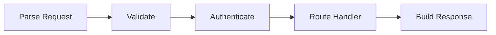

# Walk the Code — Code Walkthrough Generation

Create or update interactive code walkthroughs for any codebase using [walk-the-code](https://github.com/danilop/walk-the-code). The output is a web-based explanation where readers click code lines to see annotations, diagrams highlight relevant nodes as they navigate, and guided tours walk through key concepts. The hierarchy labels (chapters/labs) are customizable via the `terminology` field in config.json — for example "Modules/Lessons" or "Parts/Steps".

For exact config schema, comment format, diagram syntax, and CLI commands, read the walk-the-code README:
https://github.com/danilop/walk-the-code/blob/main/README.md

Do NOT memorize or duplicate the schema — always fetch the latest README when you need field names, formats, or CLI syntax. The tool evolves and the README is the source of truth.

## Workflow

### Step 1: Assess the codebase

Read the repository structure. Identify:
- **Core files** — the files that implement the main logic (not tests, configs, docs, build scripts)
- **Entry points** — where execution starts (main functions, request handlers, CLI entry points)
- **Key abstractions** — the 3-5 most important classes, functions, or modules
- **Data flow** — how data moves through the system (input → processing → output)
- **Dependencies between files** — which files call/import which

### Step 2: Design the walkthrough structure

Before writing any annotations, plan the structure:

1. **Decide what to explain.** Not every file needs annotation. Focus on files that teach something. A 50-file repo might have 8-15 files worth walking through.

2. **Group into chapters.** Each chapter should teach one concept or cover one subsystem. Use nested chapters for large codebases:
   - Small repo (1-5 files): no chapters needed, just labs
   - Medium repo (5-20 files): 2-5 chapters
   - Large repo (20+ files): nested chapters (parts → chapters → labs)

3. **Order for learning, not for the file system.** Start with the entry point or the simplest concept, then build up. The reader should never encounter something that depends on a concept they haven't seen yet.

4. **Plan diagrams early.** Identify 2-4 architectural diagrams that can be reused across multiple files with different node highlights. One good diagram reused 10 times is better than 10 mediocre diagrams.

### Step 3: Create or update the project

Check if `config.json` exists in the walk-the-code directory.

**If creating from scratch:**
1. Create the directory structure: `walk-the-code/config.json`, `walk-the-code/comments/`, `walk-the-code/diagrams/`
2. Write `config.json` directly with the real project structure — do NOT use `wtc-init` (that creates a hello-world scaffold meant for manual authoring)
3. For multi-file labs, use the `files` array; for single-file labs, use `file`
4. Set `code_dir` to point at the source code relative to config.json
5. Create `walk-the-code/start.sh` so the user can launch the walkthrough with `./walk-the-code/start.sh`:
   ```bash
   #!/usr/bin/env bash
   set -e
   PORT="${1:-8000}"
   CONFIG="$(cd "$(dirname "$0")" && pwd)/config.json"
   echo "Opening walkthrough at http://localhost:$PORT"
   (sleep 1 && python3 -m webbrowser "http://localhost:$PORT") &
   exec wtc-serve --config "$CONFIG" "$PORT"
   ```
   Make it executable (`chmod +x`).

**If updating after code changes:**
1. Run `wtc-validate path/to/config.json` to find stale annotations and coverage gaps
2. Focus on files with hash mismatches (code changed but annotation didn't)
3. Update only the affected comment entries
4. Add annotations for new code that lacks coverage

### Step 4: Write annotations

This is where quality matters most. For each annotated line, write the comment JSON entry.

**Explain WHY, not WHAT.** The reader can see the code. They need to understand the intent.

- Bad: "This line creates a variable called `cache`."
- Good: "A dictionary cache avoids recomputing attention scores for tokens we've already processed. Without this, inference time grows quadratically with sequence length."

**Connect to the bigger picture.** Every annotation should help the reader build a mental model of the system.

- Bad: "Call the `process()` function."
- Good: "This is where the request enters the middleware pipeline. Each middleware in the chain can inspect, modify, or short-circuit the request before it reaches the route handler."

**Use `important: true` sparingly.** Mark only architectural boundaries, key design decisions, or "aha moment" lines — roughly 10-15% of annotated lines.

**Annotate selectively.** Target 30-60% coverage. Skip imports, boilerplate, and obvious code.

**Write for the audience.** Infer from the codebase:
- Educational repo → explain from first principles
- Library/framework → explain design decisions and extension points
- Application → explain business logic and data flow

### Step 5: Create diagrams

A single Mermaid diagram reused across many lines with different highlights creates a visual walkthrough where the reader sees their position in the architecture as they navigate.

**Design for reuse.** Create one diagram per subsystem or data flow, then reference it from many lines with different `highlight` values.

**Use meaningful node IDs** — they appear in `highlight` arrays:


Then in annotations:
```json
{
  "15": {"text": "Parse the incoming HTTP request.", "diagram": "request_flow", "highlight": ["input"]},
  "28": {"text": "Validate request parameters.", "diagram": "request_flow", "highlight": ["validate"]},
  "45": {"text": "Check authentication token.", "diagram": "request_flow", "highlight": {"nodes": ["auth"], "links": [1]}}
}
```

**Chapter diagrams for overview.** Each chapter should have an inline `diagram` field showing the high-level concept.

**Diagram types:** data flow (`graph LR`), architecture (`graph TD`), sequence (`sequenceDiagram`), state (`stateDiagram-v2`).

**Do not add custom colors or styles.** No `style`, `classDef`, `:::`, or `fill:`/`color:` directives. Walk-the-code applies its own dark theme — custom colors cause unreadable text (e.g. light text on light backgrounds). Write plain Mermaid and let the theme handle it.

### Step 6: Add learning objectives and exercises

For each lab, add `learning_objectives` (2-4 concrete outcomes).

Exercises are optional. Include them when the reader can learn by modifying the code:
- Educational repos — always
- Libraries/frameworks — for extension points and configuration
- Applications — for business logic that can be experimented with
- Skip for read-only concepts (architecture overviews, deployment configs)

Good exercises change one thing and make the reader predict or observe the consequence:
```json
{
  "prompt": "Change the batch size from 32 to 1 and compare training time. Why is the single-example version slower despite doing less work per step?",
  "hint": "Look at GPU utilization. Matrix multiplications are more efficient when they operate on larger tensors."
}
```

For chapters, add `knowledge_checks` — multiple-choice questions that test conceptual understanding.

### Step 7: Validate and hash

1. Run `uv run python add_hashes.py path/to/config.json` to compute content hashes
2. Run `wtc-validate path/to/config.json` to check for errors
3. Fix any errors, review warnings

### Step 8: Preview

Tell the user to run `./walk-the-code/start.sh` — it starts the server and opens the browser automatically. Then verify:
- Annotations appear on the correct lines
- Diagrams render and highlights work
- Navigation between labs and chapters is logical
- The guided tour (`?tour=true`) flows naturally

## Content quality checklist

- [ ] Every annotated line explains WHY, not WHAT
- [ ] `important` lines mark architectural boundaries (10-15% of annotations)
- [ ] At least 2 reusable diagrams with per-line highlighting
- [ ] Chapters have descriptions and overview diagrams
- [ ] Labs have learning objectives and exercises where appropriate
- [ ] The reading order builds concepts progressively (no forward references)
- [ ] `wtc-validate` passes with zero errors
- [ ] Annotation coverage is 30-60% (not too sparse, not noise)
