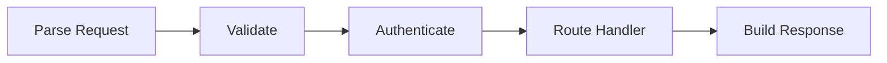

# Walk the Code — Tutorial Generation Skill

## Purpose

Generate and maintain interactive, line-by-line code tutorials for any codebase using [walk-the-code](https://github.com/danilop/walk-the-code). The output is a web-based tutorial where readers click code lines to see explanations, diagrams highlight relevant nodes as they navigate, and guided tours walk through key concepts.

## When to use

- User asks to create a code walkthrough, tutorial, or explanation for a repository
- User asks to update or improve existing walk-the-code annotations
- User asks to explain a codebase visually

## Reference

For exact config schema, comment format, diagram syntax, and CLI commands, read the walk-the-code README:
https://github.com/danilop/walk-the-code/blob/main/README.md

Do NOT memorize or duplicate the schema — always fetch the latest README when you need field names, formats, or CLI syntax. The tool evolves and the README is the source of truth.

## Workflow

### Step 1: Assess the codebase

Read the repository structure. Identify:
- **Core files** — the files that implement the main logic (not tests, configs, docs, build scripts)
- **Entry points** — where execution starts (main functions, request handlers, CLI entry points)
- **Key abstractions** — the 3-5 most important classes, functions, or modules
- **Data flow** — how data moves through the system (input → processing → output)
- **Dependencies between files** — which files call/import which

### Step 2: Design the tutorial structure

Before writing any annotations, plan the structure:

1. **Decide what to explain.** Not every file needs annotation. Focus on files that teach something. A 50-file repo might have 8-15 files worth walking through.

2. **Group into chapters.** Each chapter should teach one concept or cover one subsystem. Use nested chapters for large codebases:
   - Small repo (1-5 files): no chapters needed, just labs
   - Medium repo (5-20 files): 2-5 chapters
   - Large repo (20+ files): nested chapters (parts → chapters → labs)

3. **Order for learning, not for the file system.** Start with the entry point or the simplest concept, then build up. The reader should never encounter something that depends on a concept they haven't seen yet.

4. **Plan diagrams early.** Identify 2-4 architectural diagrams that can be reused across multiple files with different node highlights. One good diagram reused 10 times is better than 10 mediocre diagrams.

### Step 3: Create or update the project

Check if `config.json` exists in the walk-the-code directory.

**If creating from scratch:**
1. Create the directory structure: `walk-the-code/config.json`, `walk-the-code/comments/`, `walk-the-code/diagrams/`
2. Write `config.json` directly with the real project structure — do NOT use `wtc-init` (that creates a hello-world scaffold meant for manual authoring)
3. For multi-file labs, use the `files` array; for single-file labs, use `file`
4. Set `code_dir` to point at the source code relative to config.json

**If updating after code changes:**
1. Run `wtc-validate path/to/config.json` to find stale annotations and coverage gaps
2. Focus on files with hash mismatches (code changed but annotation didn't)
3. Update only the affected comment entries
4. Add annotations for new code that lacks coverage

### Step 4: Write annotations

This is where quality matters most. For each annotated line, write the comment JSON entry.

#### Quality principles

**Explain WHY, not WHAT.** The reader can see the code. They need to understand the intent.

Bad: "This line creates a variable called `cache`."
Good: "A dictionary cache avoids recomputing attention scores for tokens we've already processed. Without this, inference time grows quadratically with sequence length."

**Connect to the bigger picture.** Every annotation should help the reader build a mental model of the system.

Bad: "Call the `process()` function."
Good: "This is where the request enters the middleware pipeline. Each middleware in the chain can inspect, modify, or short-circuit the request before it reaches the route handler."

**Use `important: true` sparingly.** Mark only architectural boundaries, key design decisions, or "aha moment" lines — roughly 10-15% of annotated lines. These are the lines that, if you understood only them, you'd understand the system.

**Annotate selectively.** Not every line needs an annotation. Skip:
- Import statements (unless the import itself is surprising or educational)
- Boilerplate (standard error handling, logging setup)
- Obvious code (variable assignments where the name says it all)

Target 30-60% annotation coverage. Higher isn't better — it's noise.

**Use HTML in annotations** for emphasis, code references, and links between concepts:
```json
{
  "42": {
    "text": "<p>The <code>attention</code> function computes <strong>scaled dot-product attention</strong>: Q·K<sup>T</sup> / √d<sub>k</sub>.</p><p>Scaling by √d prevents the dot products from growing too large, which would push softmax into regions with tiny gradients.</p>",
    "important": true,
    "diagram": "attention_flow",
    "highlight": ["QK_dot", "scale"]
  }
}
```

#### Writing for different audiences

Infer the audience from the codebase:
- **Educational repo** (tutorials, examples): explain concepts from first principles, assume no prior knowledge of the domain
- **Library/framework**: explain design decisions and extension points, assume the reader knows the language
- **Application**: explain the business logic and data flow, assume the reader is onboarding to the team

### Step 5: Create diagrams

Diagrams are the most powerful feature. A single Mermaid diagram reused across many lines with different highlights creates a visual walkthrough where the reader sees their position in the architecture as they navigate.

#### Diagram design principles

**Design for reuse.** Create one diagram per subsystem or data flow, then reference it from many lines with different `highlight` values. The reader sees the same diagram with different nodes lit up as they click through the code.

**Use meaningful node IDs.** Node IDs appear in the `highlight` arrays, so make them descriptive:


Then in annotations:
```json
{
  "15": {"text": "Parse the incoming HTTP request.", "diagram": "request_flow", "highlight": ["input"]},
  "28": {"text": "Validate request parameters.", "diagram": "request_flow", "highlight": ["validate"]},
  "45": {"text": "Check authentication token.", "diagram": "request_flow", "highlight": {"nodes": ["auth"], "links": [1]}}
}
```

**Highlight links for data flow.** Use `"links": [0, 1]` (zero-based Mermaid link indices) to highlight the arrows between nodes, showing the path data takes.

**Chapter diagrams for overview.** Each chapter should have an inline `diagram` field showing the high-level concept. This is separate from the per-line diagrams in `diagrams/`.

#### Diagram types to consider

- **Data flow** (`graph LR`): how data moves through the system — best for pipelines, request handling, ETL
- **Architecture** (`graph TD`): component relationships — best for chapter overviews
- **Sequence** (`sequenceDiagram`): interaction between components over time — best for protocols, API calls
- **State** (`stateDiagram-v2`): state machines — best for connection handling, lifecycle management

### Step 6: Add learning objectives and exercises

For each lab, add:
- `learning_objectives`: 2-4 concrete outcomes ("Understand how the KV cache eliminates redundant computation")
- `exercises` (optional): 1-3 hands-on prompts that ask the reader to modify the code and observe the effect

**When to include exercises:**
- Educational repos, tutorials, courses — always. Exercises are the primary learning mechanism.
- Libraries/frameworks — when the lab explains an extension point or configuration. ("Change the middleware order and observe how it affects request processing.")
- Applications — when the lab covers business logic that can be experimented with safely.
- Skip exercises for labs that explain read-only concepts (architecture overviews, deployment configs) where modifying the code wouldn't teach anything.

Good exercises change one thing and make the reader predict or observe the consequence:
```json
{
  "prompt": "Change the batch size from 32 to 1 and compare training time. Why is the single-example version slower despite doing less work per step?",
  "hint": "Look at GPU utilization. Matrix multiplications are more efficient when they operate on larger tensors."
}
```

For chapters, add `knowledge_checks` — multiple-choice questions that test conceptual understanding, not memorization.

### Step 7: Validate and hash

After writing all annotations:

1. Run `uv run python add_hashes.py path/to/config.json` to compute content hashes
2. Run `wtc-validate path/to/config.json` to check for errors
3. Fix any errors (missing files, broken diagram references, out-of-range line numbers)
4. Review warnings (low coverage, missing objectives/exercises)

### Step 8: Preview

Run `wtc-serve --config path/to/config.json` and open the browser to verify:
- Annotations appear on the correct lines
- Diagrams render and highlights work
- Navigation between labs and chapters is logical
- The guided tour (`?tour=true`) flows naturally

## Content quality checklist

Before considering the tutorial complete, verify:

- [ ] Every annotated line explains WHY, not WHAT
- [ ] `important` lines mark architectural boundaries (10-15% of annotations)
- [ ] At least 2 reusable diagrams with per-line highlighting
- [ ] Chapters have descriptions and overview diagrams
- [ ] Labs have learning objectives and exercises where appropriate (see Step 6)
- [ ] The reading order builds concepts progressively (no forward references)
- [ ] `wtc-validate` passes with zero errors
- [ ] Annotation coverage is 30-60% (not too sparse, not noise)
